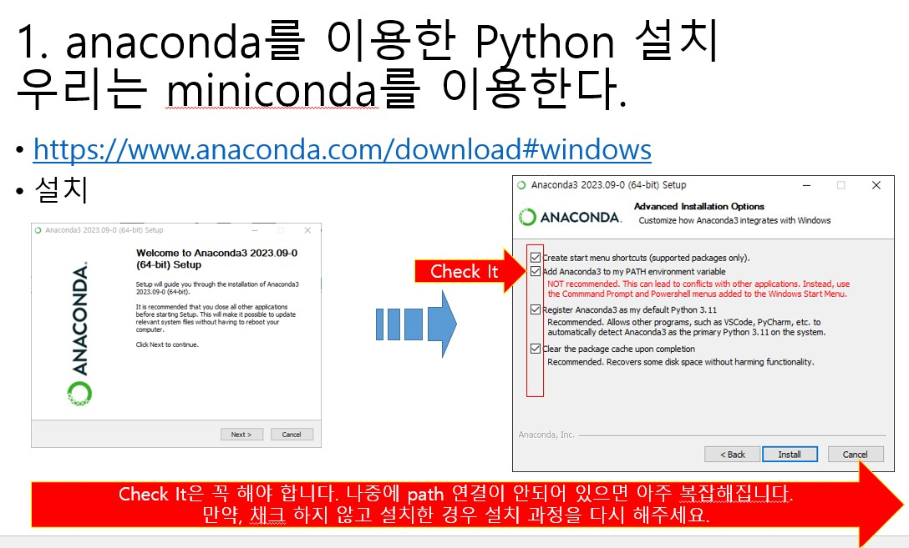
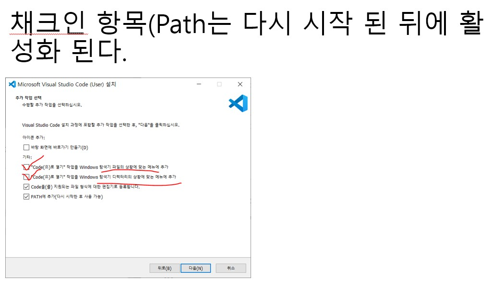
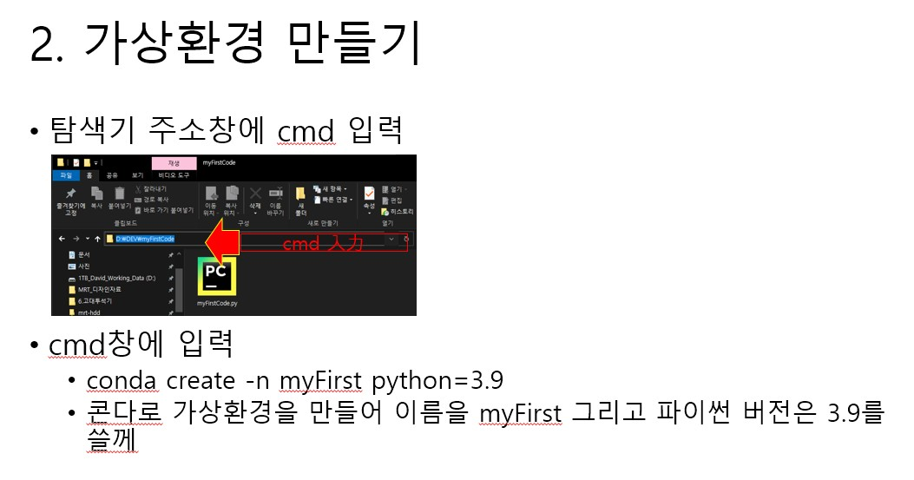
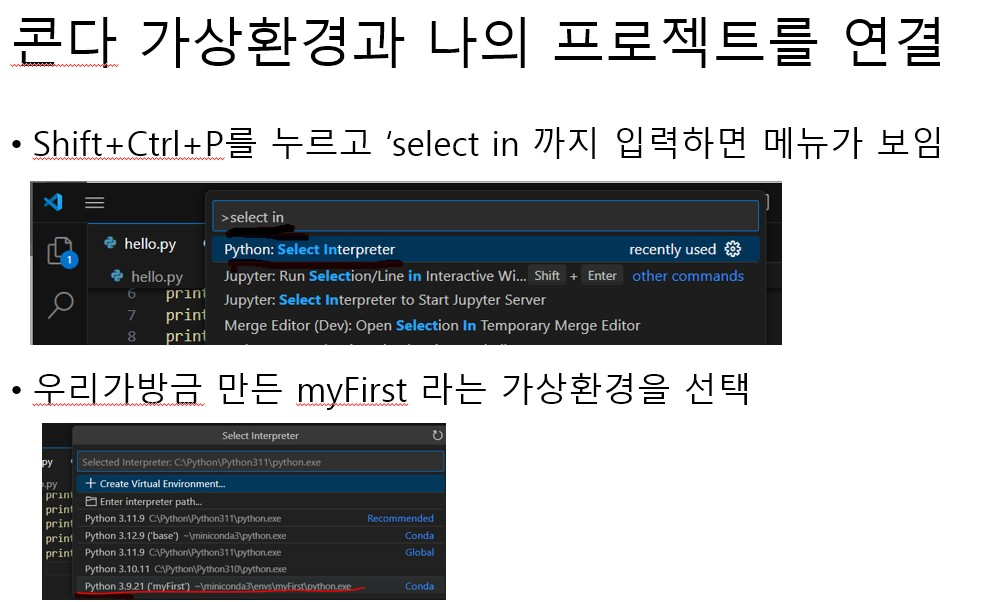
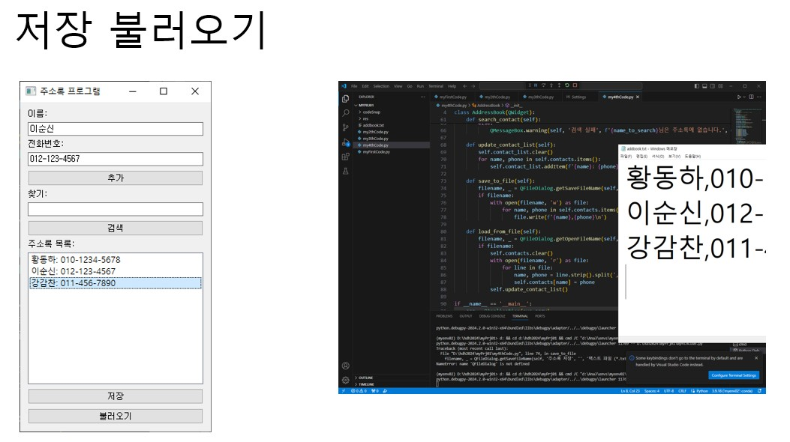

# installation_Python

## 파이썬 개발 환경 구축
1. anaconda 또는 miniconda를 이용해서 python interpreter를 설치했다.
 

2. vscode를 설치했다.
 

## 파이썬 가상 환경
3. 가상환경을 생성
 

4. 가상환경과 VSCode를 연결
 

## 프로그램 실행
5. 완성된 주소록 프로그램
 
